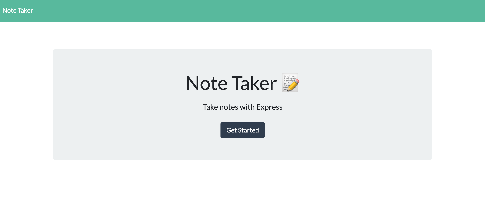
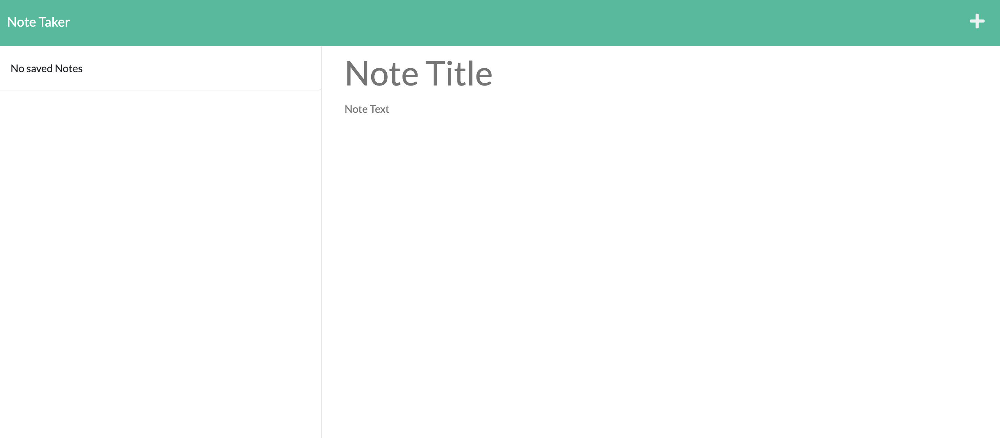
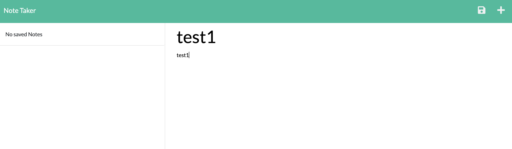
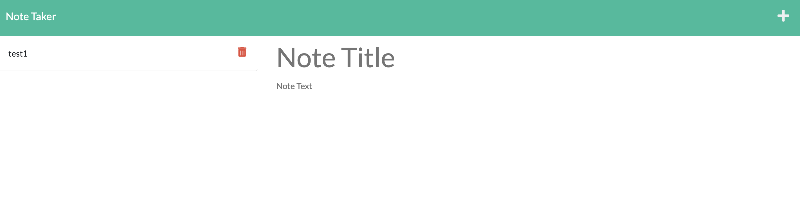

# Note Taker

[![Contributors][contributors-shield]][contributors-url]
[![Forks][forks-shield]][forks-url]
[![Stargazers][stars-shield]][stars-url]
[![Issues][issues-shield]][issues-url]
[![MIT License][license-shield]][license-url]

<!-- PROJECT LOGO -->
<br />
<p align="center">
  <a href="https://github.com/jsun994/taker-notes-4u">
    
  </a>

  <p align="center">
  A professional note taker.
    <br />
    <a href="https://github.com/jsun994/taker-notes-4u"><strong>Explore the docs »</strong></a>
    <br />
    <br />
    <a href="https://taker-notes-4u.herokuapp.com/">View Demo</a>
    ·
    <a href="https://github.com/jsun994/taker-notes-4u/issues">Report Bug</a>
    ·
    <a href="https://github.com/jsun994/taker-notes-4u/issues">Request Feature</a>
  </p>
</p>

<!-- TABLE OF CONTENTS -->
<details open="open">
  <summary><h2 style="display: inline-block">Table of Contents</h2></summary>
  <ol>
    <li>
      <a href="#about-the-project">About The Project</a>
      <ul>
        <li><a href="#built-with">Built With</a></li>
      </ul>
    </li>
    <li>
      <a href="#getting-started">Getting Started</a>
      <ul>
        <li><a href="#prerequisites">Prerequisites</a></li>
        <li><a href="#installation">Installation</a></li>
      </ul>
    </li>
    <li><a href="#usage">Usage</a></li>
    <li><a href="#contributing">Contributing</a></li>
    <li><a href="#contact">Contact</a></li>
  </ol>
</details>

<!-- ABOUT THE PROJECT -->
## About The Project


Demo - [Heroku](https://taker-notes-4u.herokuapp.com/)

### Built With

* Node JS
* Express
* Uniqid
* FS & Path

<!-- GETTING STARTED -->
## Getting Started

To get a local copy up and running follow these simple steps.

### Prerequisites

This is an example of how to list things you need to use the software and how to install them.
* npm
  ```sh
  npm install npm@latest -g
  ```

### Installation

1. Clone the repo
   ```sh
   git clone git@github.com:jsun994/taker-notes-4u.git
   ```
2. Install NPM packages
   ```sh
   npm install
   ```

<!-- USAGE EXAMPLES -->
## Usage

    GIVEN a note-taking application
    WHEN I open the Note Taker
    THEN I am presented with a landing page with a link to a notes page
    WHEN I click on the link to the notes page
    THEN I am presented with a page with existing notes listed in the left-hand column, plus empty fields to enter a new note title and the note’s text in the right-hand column
    WHEN I enter a new note title and the note’s text
    THEN a Save icon appears in the navigation at the top of the page
    WHEN I click on the Save icon
    THEN the new note I have entered is saved and appears in the left-hand column with the other existing notes
    WHEN I click on an existing note in the list in the left-hand column
    THEN that note appears in the right-hand column
    WHEN I click on the Write icon in the navigation at the top of the page
    THEN I am presented with empty fields to enter a new note title and the note’s text in the right-hand column
    WEHN I click on the Delete icon
    THEN that note is deleted from the notes page





<!-- CONTRIBUTING -->
## Contributing

1. Fork the Project
2. Create your Feature Branch (`git checkout -b feature/AmazingFeature`)
3. Commit your Changes (`git commit -m 'Add some AmazingFeature'`)
4. Push to the Branch (`git push origin feature/AmazingFeature`)
5. Open a Pull Request

<!-- CONTACT -->
## Contact

Jay Sun - jaysun054@gmail.com

[contributors-shield]: https://img.shields.io/github/contributors/jsun994/taker-notes-4u.svg?style=for-the-badge
[contributors-url]: https://github.com/jsun994/taker-notes-4u/graphs/contributors
[forks-shield]: https://img.shields.io/github/forks/jsun994/taker-notes-4u.svg?style=for-the-badge
[forks-url]: https://github.com/jsun994/taker-notes-4u/network/members
[stars-shield]: https://img.shields.io/github/stars/jsun994/taker-notes-4u.svg?style=for-the-badge
[stars-url]: https://github.com/jsun994/taker-notes-4u/stargazers
[issues-shield]: https://img.shields.io/github/issues/jsun994/taker-notes-4u.svg?style=for-the-badge
[issues-url]: https://github.com/jsun994/taker-notes-4u/issues
[license-shield]: https://img.shields.io/github/license/jsun994/taker-notes-4u.svg?style=for-the-badge
[license-url]: https://github.com/jsun994/taker-notes-4u/blob/master/LICENSE.txt